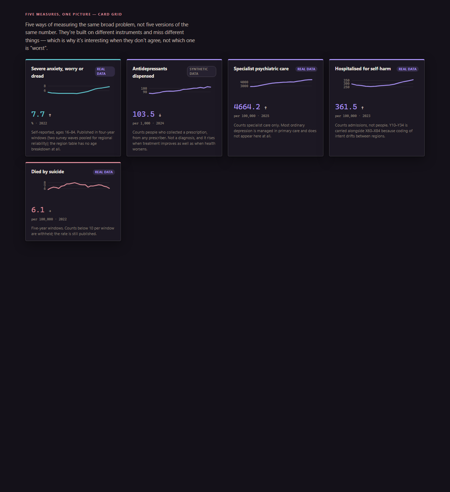
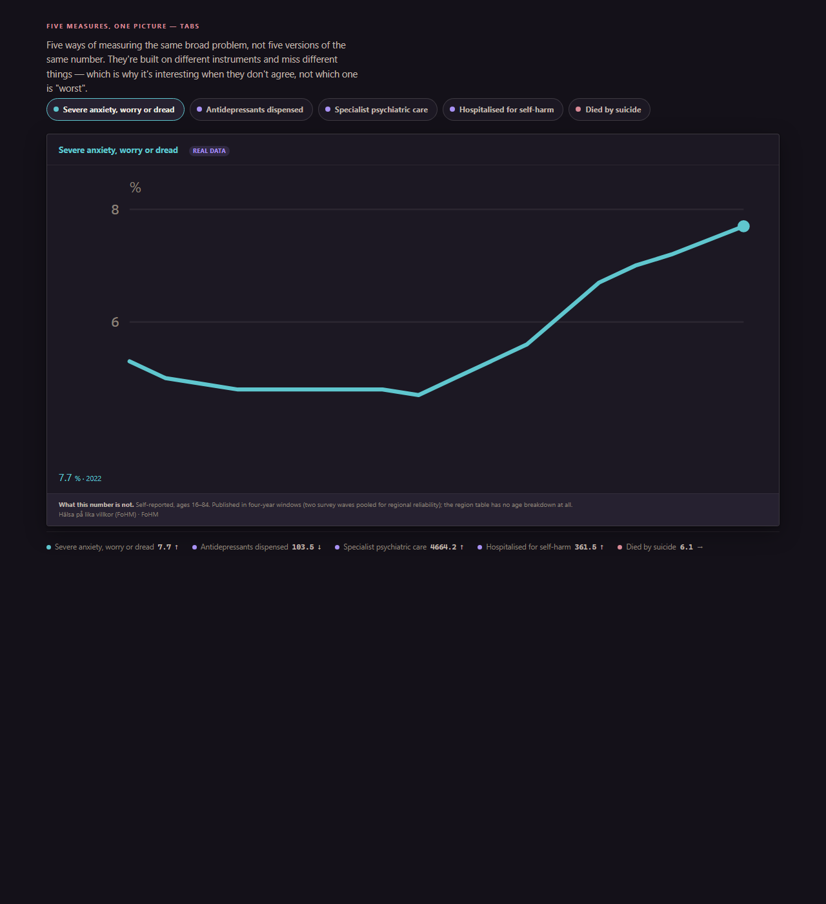
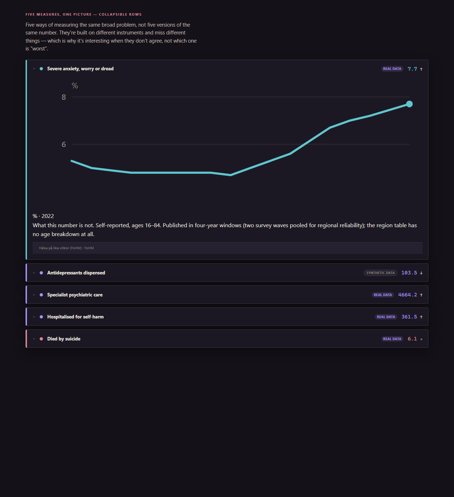

# Overview structure sketches (Task 1)

Three structures for presenting the five indicators (distress, antidep,
psych, selfharm, suicide) and how they relate. Each is a standalone page —
open directly in a browser, no build step — that loads the real
`data.js`/`lang.js`/`charts.js` (real numbers where a fetcher has run,
synthetic fallback otherwise, exactly like the main app), but skips
`shell.js` entirely so it doesn't try to boot the full nav/scroll-spy shell.
None of this is wired into `kurvan.html` — zero risk to the production app.

Shared files: `shared.js` (data prep, reused by all three),
`overview.css` (layout rules layered on top of `../kurvan.css`).

Every structure uses the *same* underlying data and the *same* per-card
caveat (`t.notNumB[k]`, the app's existing "what this number is not" line)
— what changes is only how the five are arranged, not what's said about
them. None of them rank the indicators or call anything a "gap"; the
intent is to make disagreement visible, not verdicts.

## 1. Card grid — [overview-cards.html](overview-cards.html)

All five visible at once, side by side, equal weight. No interaction
needed — the read is a spatial scan across the row: which lines are
trending the same way, which aren't. Best fit for the "disagreement is the
finding" framing, since nothing has to be expanded to compare two
indicators against each other. Weakest at depth — each card's caveat is
necessarily short, and there's no room for the full source citation.

## 2. Tabs — [overview-tabs.html](overview-tabs.html)

One indicator's full detail (bigger chart, full caveat, source line) at a
time, picked from a toggle row — but a persistent "at a glance" strip below
always shows all five latest values + direction arrows, so switching tabs
never loses the cross-indicator view entirely. Best fit for depth on one
measure at a time; the glance strip is a deliberate compromise so
relationship-reading survives the drill-down. Weakest at *simultaneous*
comparison — you're always looking at one chart, five numbers.

## 3. Collapsible rows — [overview-accordion.html](overview-accordion.html)

Reads top-to-bottom like the app's existing scroll pattern, one row per
indicator, collapsed by default past the first. Unlike the tabs, any number
of rows can be open at once — expand two or three side by side to compare
their full charts directly. Middle ground between the other two: less
simultaneous than the card grid, more comparable than the tabs, costs a
click per indicator you want to see in depth.

## Read

Card grid serves the "relationships, not ranking" goal most directly,
since all five are always on screen with nothing to expand — that
matters for a structure whose whole point is inviting a reader to notice
disagreement themselves. Tabs and accordion both trade some of that away
for room to say more about each measure's limits. Worth looking at all
three before deciding; this is a judgement call about what the overview is
*for* (a scan vs. a set of five short essays), not just a layout
preference.
